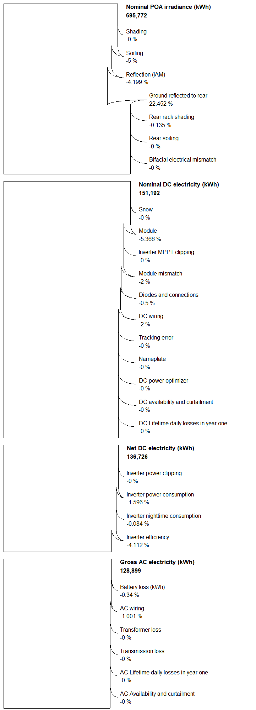
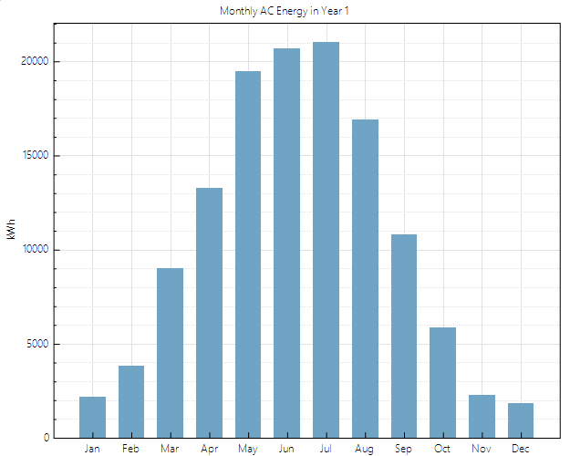

# Conception et Dimensionnement d'une Station de Recharge Hybride (PV + Stockage) pour Superchargeurs Tesla

<p align="center">
  
  
  
  
  
  
</p>

---

## 📌 Présentation du Projet

Ce projet présente l'étude complète d'ingénierie, de dimensionnement électrotechnique, de modélisation 3D, de simulation technico-économique et de stratégie de contrôle intelligent (**Energy Management System - EMS**) pour la conversion de la **Station Supercharger Tesla** située sur la **Route de Sefrou à Fès (Maroc)**, adjacente au magasin **KITEA Giant**, en un **Hub Énergétique Hybride et Intelligent**.

<p align="center">
  
  <br />
  <em>Modélisation 3D SketchUp : Implantation des 180 modules solaires sur la toiture KITEA Giant, conteneur BESS Huawei LUNA2000 et bornes Tesla Superchargers.</em>
</p>

### ⚠️ Problématique
Les bornes de recharge ultra-rapides Tesla (Superchargers V2/V3) délivrent des appels de puissance instantanés très élevés (**jusqu'à 150 kW par borne**). L'exploitation simultanée de ces bornes engendre :
1. **Une saturation du réseau électrique local (RADEEF)** et un risque de surcharge thermique sur le transformateur moyenne/basse tension.
2. **Des pénalités financières sévères** liées aux dépassements de la puissance souscrite lors des pointes de demande.

### 💡 Solution Proposée
Mise en place d'une architecture en **Couplage AC** exploitant la grande surface de toiture disponible du bâtiment KITEA pour la génération solaire photovoltaïque, couplée à un système de stockage par batteries industrielles (**BESS**) situé aux abords des bornes. L'ensemble est synchronisé en temps réel par un automate de gestion de l'énergie (**EMS**) assurant l'écrêtage des pointes (*Peak Shaving*) et l'arbitrage tarifaire.

---

## ⚡ Spécifications Techniques du Système

### 1. Générateur Photovoltaïque (Toiture KITEA)
* **Technologie des cellules :** Monocristallin n-type bifacial haute efficacité.
* **Modules solaires :** 180 × **JA Solar JAM66D46-LB 740 W**.
* **Puissance crête installée :** **133,2 kWc**.
* **Onduleur de chaîne :** 1 × **Huawei SUN2000-100KTL-M1** (Puissance nominale : 100 kW AC, 10 MPPT indépendants, rendement max 98,8%).
* **Configuration électrique :** 10 chaînes (*strings*) de 18 modules en série (1 chaîne par MPPT).
  * $V_{oc} \text{ à } -5^\circ\text{C} = 53,54\text{ V} \implies V_{\text{chaîne}} = 963,7\text{ V} \le 1100\text{ V}$ (Conforme).
  * $I_{sc} = 18,73\text{ A} \le I_{\text{sc max MPPT}} (40\text{ A})$ (Conforme).
  * Ratio DC/AC : $\frac{133,2\text{ kWc}}{100\text{ kW}} = \mathbf{1,33}$ (Dimensionnement optimal).

### 2. Système de Stockage d'Énergie BESS (Station Tesla)
* **Équipement :** 2 × **Huawei LUNA2000-200KWH-2H1** Smart String ESS.
* **Capacité nominale totale :** **400 kWh** (~387 kWh utiles à 90% DoD).
* **Puissance de décharge continue :** **200 kW** (Courant max : 144,3 A triphasé 400 V).
* **Convertisseurs :** Smart Rack Controller (**SRC**) stabilisant le bus DC à 1100 V et Power Conversion System (**PCS**) injectant en triphasé 400 V.
* **Autonomie :** Capacité suffisante pour assurer la recharge complète de **~6 véhicules électriques** sans solliciter le réseau.

### 3. Câblage et Raccordement Électrique
* **Liaison Toiture KITEA $\rightarrow$ Station Tesla :** Distance de **100 m**.
* **Câble de puissance AC retenu :** Câble cuivre **U-1000 R2V 4×70 mm²** (chute de tension $\Delta U < 3\%$, sécurisant la section théorique de 50 mm²).
* **Point de couplage commun (PCC) :** TGBT Station (Bus AC 400 V triphasé).
* **Protections :** Disjoncteurs boîtiers moulés (MCCB) calibrés à 160 A avec sélectivité ampèremétrique et chronométrique.

---

## 🧠 Stratégie de Contrôle Intelligent (EMS)

L'installation est pilotée par le **Huawei SmartLogger 3000A**, communicant via le protocole **Modbus-RTU (RS-485)** avec l'onduleur PV, les contrôleurs de batterie SRC et le compteur d'énergie bidirectionnel **DTSU666-H** (équipé de 3 transformateurs de courant 5A).

```
                      ┌───────────────────────────────┐
                      │    Réseau Public (RADEEF)     │
                      └──────────────┬────────────────┘
                                     │  Transformateurs de courant (TC)
                                     ▼  + Smart Power Sensor DTSU666-H
                      ┌───────────────────────────────┐
                      │    TGBT Station (Bus AC)      │
                      └───┬───────────┬───────────┬───┘
                          │           │           │
       Puissance Solaire  │           │           │  Décharge Peak Shaving
                          ▼           ▼           ▼
┌───────────────────────────┐   ┌───────────┐   ┌───────────────────────────┐
│ Onduleur Huawei           │   │  Bornes   │   │ BESS Huawei LUNA2000      │
│ SUN2000-100KTL-M1         │   │   Tesla   │   │ PCS + SRC (200 kW/400 kWh)│
│ (133.2 kWc PV Toiture)    │   │  Super-   │   └─────────────┬─────────────┘
└─────────────┬─────────────┘   │  chargers │                 │
              │                 └───────────┘                 │
              └───────────────┐               ┌───────────────┘
                     RS-485   │               │   RS-485
                              ▼               ▼
                      ┌───────────────────────────────┐
                      │   Huawei SmartLogger 3000A    │
                      │    (Cerveau EMS Centralisé)   │
                      └───────────────────────────────┘
```

### Modes de Fonctionnement Prioritaires :
1. **Écrêtage des pointes (Peak Shaving) :** Dès que la demande des Superchargeurs franchit le seuil critique contractuel (ex. 100 kW), le SmartLogger déclenche instantanément la décharge des batteries LUNA2000 à concurrence de 200 kW pour soulager le réseau.
2. **Arbitrage Tarifaire (Time-of-Use) :** Injection de l'énergie stockée durant les heures pleines/pointe en soirée pour éviter la tarification élevée du kWh.
3. **Autoconsommation & Compensation Carbone :** Priorité absolue à la consommation directe des électrons verts produits sur site.

---

## 📊 Résultats des Simulations SAM (System Advisor Model)

Les simulations de performance ont été exécutées avec le logiciel **SAM (NREL)** en utilisant les données météorologiques horaires typiques de Fès :

| Indicateur Clé (KPI) | Valeur Simulée |
| :--- | :--- |
| **Production annuelle nette AC (Année 1)** | **127 169 kWh** |
| **Ratio de Performance (PR)** | **0,77 (77,0%)** |
| **Productible spécifique** | **954 kWh/kWc** |
| **Facteur de charge DC** | **10,9%** |
| **Rendement de cycle batterie (Roundtrip)** | **96,37%** |
| **Taux de charge batterie par le système PV** | **100,0%** |

### Graphiques de Simulation

<table align="center">
  <tr>
    <td align="center" width="50%">
      <b>Diagramme des Pertes Systémiques (Sankey)</b><br />
      
    </td>
    <td align="center" width="50%">
      <b>Production AC Mensuelle (Année 1)</b><br />
      
    </td>
  </tr>
  <tr>
    <td align="center" colspan="2">
      <b>Mix Énergétique & Couverture de la Charge (PV vs Batterie vs Réseau)</b><br />
      
    </td>
  </tr>
</table>

---

## 💰 Analyse Économique & Rentabilité

### 1. Bilan d'Investissement (CAPEX)

| Désignation | Quantité | Prix Unitaire H.T. (MAD) | Montant Total H.T. (MAD) |
| :--- | :---: | :---: | :---: |
| Modules JA Solar JAM66D46-LB 740W | 180 | 1 200,00 | 216 000,00 |
| Câble solaire & AC (340 m) | 1 lot | - | 22 100,00 |
| Structure de montage toiture & brides | 1 lot | - | 106 560,00 |
| Onduleur Huawei SUN2000-100KTL-M1 | 1 | 50 000,00 | 50 000,00 |
| Huawei SmartLogger 3000A | 1 | 7 000,00 | 7 000,00 |
| Transformateurs de courant (TC) | 3 | 1 200,00 | 3 600,00 |
| Compteur intelligent DTSU666-H | 1 | 3 500,00 | 3 500,00 |
| Huawei LUNA2000-200KWH-2H1 (BESS) | 2 | 800 000,00 | 1 600 000,00 |
| Ingénierie, installation & mise en service | 1 lot | - | 159 840,00 |
| **TOTAL CAPEX H.T.** | | | **2 168 600,00 MAD** |
| **TOTAL CAPEX T.T.C. (TVA 20%)** | | | **2 602 320,00 MAD** |

### 2. Indicateurs Financiers

<p align="center">
  
</p>

* **Facture d'électricité sans le système :** 2 104 502 MAD/an ($187 733 USD)
* **Facture d'électricité avec le système :** 798 438 MAD/an ($71 282 USD)
* **Économies nettes annuelles :** **1 306 064 MAD/an** ($116 451 USD)
* **Temps de retour sur investissement (Simple Payback) :** **3,1 ans** (Discounted Payback : 3,7 ans).
* **Valeur Actuelle Nette (VAN / NPV) sur 25 ans :** **+$869 213 USD** (~ 8,7 Millions MAD).
* **Coût actualisé de l'énergie (LCOE réel) :** **17,17 ¢/kWh**.

---

## 📁 Organisation du Dépôt

```plaintext
├── .gitattributes                                       # Configuration Git LFS (fichiers .skp et .skb)
├── LICENSE                                              # Licence Open-Source MIT
├── README.md                                            # Documentation générale du projet
├── Project Summary.pdf                                  # Synthèse technique et exécutive du projet
├── PV_project.pdf                                       # Rapport d'ingénierie complet détaillé (29 pages)
│
├── Autocad/                                             # Dossier des plans techniques 2D et schémas électriques
│   ├── Support 2D.pdf                                   # Plan de la structure de supportage
│   ├── Support clamps 2D.pdf                            # Détails des brides de serrage (clamps)
│   ├── schema unifilaire commande.pdf                   # Schéma unifilaire du circuit de commande
│   ├── schéma multifilaire commande.pdf                 # Schéma multifilaire de commande
│   ├── schéma unifilaire puissance.pdf                  # Schéma unifilaire du circuit de puissance
│   └── simulations/                                     # Fichiers sources AutoCAD (.dwg, .bak)
│       ├── Support 2D.dwg
│       ├── les vues de systeme.dwg
│       ├── schema unifilaire commande.dwg
│       ├── schema unifilaire puissance.dwg
│       └── schema Multiifilaire puissance.dwg
│
├── SketchUP/                                            # Modélisation 3D de la station et du bâtiment
│   ├── SketchUP.skp                                     # Maquette 3D complète (gérée via Git LFS)
│   ├── SketchUP.skb                                     # Fichier de sauvegarde SketchUp (géré via Git LFS)
│   ├── Capture d_écran 2025-12-01 224916.png            # Rendu toiture KITEA et panneaux
│   └── Capture d_écran 2025-12-01 225010.png            # Rendu complet toiture, station Tesla et BESS
│
├── SAM/                                                 # Modélisation et simulation NREL SAM
│   ├── SAM FINAL.sam                                    # Projet source System Advisor Model
│   ├── losses.png                                       # Diagramme de pertes en cascade (Sankey)
│   ├── production.png                                   # Graphique de production mensuelle AC
│   ├── source de chargement.png                         # Répartition de couverture de charge
│   ├── Resumé.png                                       # Tableau récapitulatif des métriques financières
│   ├── inverter data/                                   # Fiches de caractérisation de l'onduleur (.csv)
│   └── module data/                                     # Fiches de caractérisation des modules (.csv)
│
└── Data sheet and user manual/                          # Fiches techniques et manuels officiels
    ├── SUN2000-100KTL-M1.pdf                            # Onduleur triphasé Huawei 100 kW
    ├── luna2000-200kwhg-2h1-dtatsheet-20230310.pdf      # Système de stockage industriel Huawei LUNA2000
    ├── SmartLogger3000A.pdf                             # Fiche technique du contrôleur de communication
    ├── Manuel d_utilisation, SmartLogger3000.pdf        # Manuel complet d'utilisation SmartLogger
    ├── JAM66D46_715-740_LB_Global_EN_20250709C.pdf      # Module solaire JA Solar 740 W
    ├── dtsu666-h-100a-datasheet.pdf                     # Capteur de puissance intelligent Huawei / Chint
    └── DTSU666-H 100 A and 250 A Smart Power Sensor...  # Manuel de câblage et configuration du compteur
```

---

## 👥 Auteurs & Affiliation Académique

Projet d'ingénierie réalisé au sein de :
* **Institution :** École Nationale des Sciences Appliquées de Fès (**ENSA Fès**) — Université Sidi Mohamed Ben Abdellah (**USMBA**).
* **Département :** Génie Industriel.
* **Filière :** Génie Énergétique et Systèmes Intelligents (**GESI**).
* **Module :** Énergie Solaire Photovoltaïque.

**Auteurs du projet :**
* **NOUARY Lhoussaine** ([@Nouary](https://github.com/Nouary))
* **AZZOUZI Wassim**
* **SAADANI Aymane**

**Sous l'encadrement de :**
* **M. CHAIBI Yassine**

---

## 📄 Licence

Ce projet est sous licence libre et open-source **[MIT](LICENSE)**. Vous êtes libre de consulter, utiliser, adapter et vous inspirer de ces travaux pour vos projets académiques et industriels, sous réserve de mentionner les auteurs originaux.